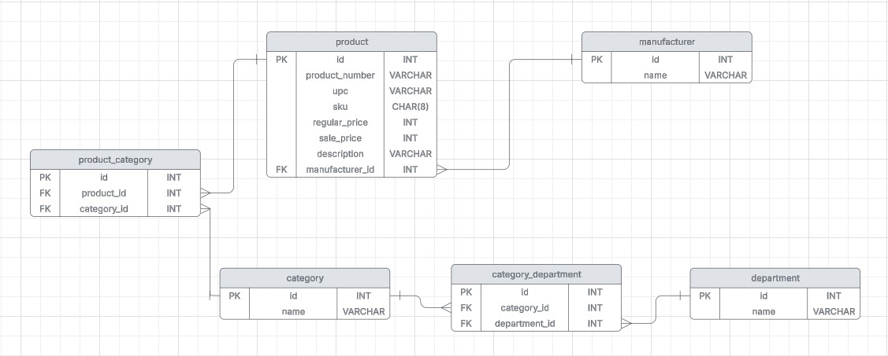

# Laravel REST API for Product Management
This project is a REST API built with Laravel, designed to handle product management, including parsing a CSV file, managing product data and exporting HTTP response data to a new CSV file.

## Features
 - **REST API implementation**
 - **CSV file processing and import**
 - **CRUD implementation**
 - **Category-based product filtering**
 - **JSON data export to CSV file**

## CSV File Processing
The CSV file for processing needs to be located in the project's root folder.  
To parse the CSV file and store data in the database, run the following Artisan command:
```
php artisan app:parse-csv-file
```
## API Usage and Testing
For testing API functionalities, use **Postman** or any API testing tool.

- Base URL:
```
http://127.0.0.1:8000/api/
```

## ER Diagram


## 📜 License
This project is open-source and available under the [MIT License](LICENSE).